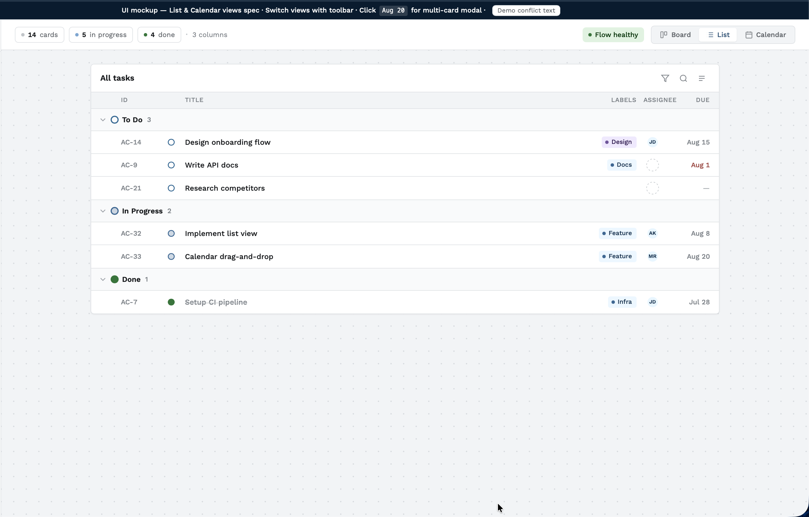
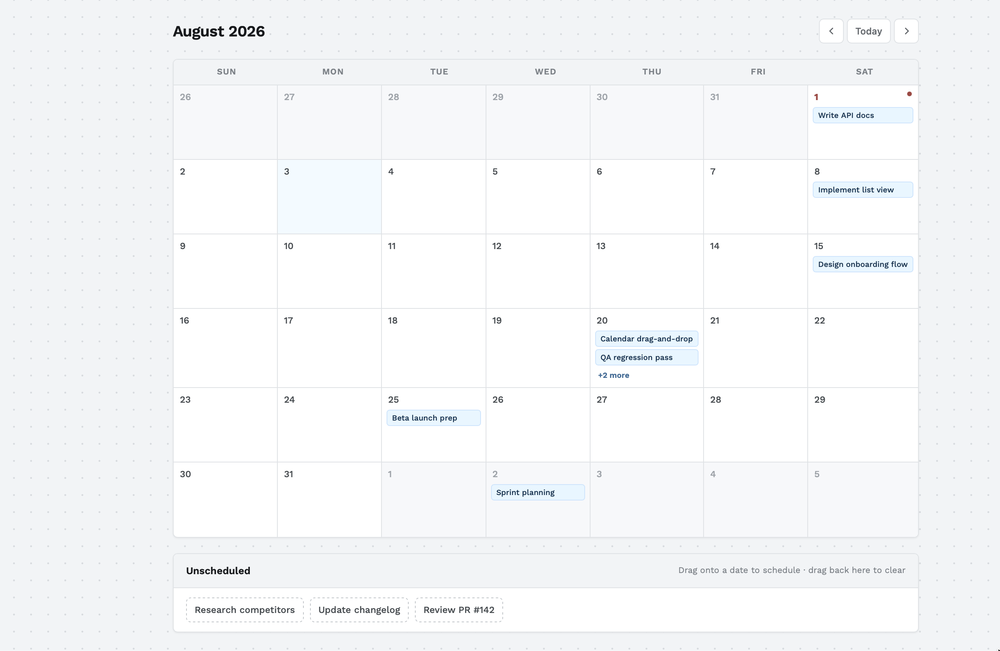

# List & Calendar Views for Camel Board

**Date:** 2026-08-03
**Status:** draft
**Author:** brainstorm session (pocket-grinding, following pocket-pitching Direction A)
**Spec path:** docs/pocket/spec/2026-08-01-workspace-pivot-scope/list-calendar-views-spec.md

---

## Summary

Camel's board is currently Kanban-only. Beta users (1000+) sent 10+ requests each for List and Calendar views of the same task data. This spec adds a persistent view switcher (Board / List / Calendar) to the existing board, where List and Calendar are read/write lenses over the exact same card data — no new storage, no new endpoints. It also adds a bidirectional Unscheduled tray so cards without a due date can be scheduled (and unscheduled) by drag.

---

## Context

### Current State
`GET /workspaces/:id/board` already returns all columns+cards in one payload (`due_date` included, `deleted_at` pre-filtered). `PATCH /cards/:id` already accepts `dueDate` independent of `position`/`column_id`, with optional optimistic-lock `version`. `BoardContext.tsx` wires a live SSE subscription (`card.created/updated/moved/reordered/deleted`) that Board already consumes. `@dnd-kit/core` + `@dnd-kit/sortable` are already installed and used for Board's card drag. No view-switcher pattern, no date library, and no List/Calendar UI exist today.

### Problem / Motivation
Camel's kanban-only shape doesn't match how the first 1000 beta users organize/view work — 10+ unprompted requests each for List view and Calendar view (see `docs/pocket/spec/2026-08-01-workspace-pivot-scope/pitch-exploration.md`). The pitch's spike confirmed this is a near-free win: read-only List and Calendar-with-reschedule both reuse existing data/write paths, with reorderable List explicitly excluded (no cross-column write path exists) and sub-project hierarchy explicitly deferred to a separate future cycle.

### Related Areas
`client/src/context/BoardContext.tsx` (data + `saveCard` + SSE), `client/src/pages/BoardPage.tsx` (nested `card/:cardId` route via `<Outlet/>`), `client/src/components/CardView.tsx` (existing `doneAt`-based done-check precedent), `client/src/components/ContextPanel.tsx` (existing conflict-handling precedent), `server/src/routes/board.ts`, `server/src/routes/cards.ts`.

---

## Scope

### In-Scope
- View switcher (Board / List / Calendar), persisted per-user per-workspace via `localStorage`, immediately re-resolved on in-app workspace switch (no reload needed)
- List view: read-only, grouped by column with headers in column order, cards ordered by board position within each group, due date shown per row (red if overdue)
- Calendar view: month grid (current month default, prev/next nav), cards rendered on their due date, drag-to-reschedule (including to past dates and adjacent-month spillover cells), red date-cell indicator for overdue cards
- Unscheduled tray: cards with `due_date = null` (excluding Done cards), bidirectional drag (tray → date sets due date; date → tray clears it)
- Single-card date-cell click opens the card detail directly (reuses existing `card/:cardId` route); multi-card date-cell click opens a list modal
- Version-conflict handling on every Calendar/tray write: adopt latest server state + small inline auto-dismissing (3s) text on the card
- "Done" status determined via existing `card.doneAt !== null` (never column-name matching)

### Out-of-Scope
- Reorderable/drag List view — no cross-column write path exists (spike-confirmed in pitching); explicitly excluded this cycle
- Sub-project hierarchy — deferred to its own future pitch/grinding cycle entirely
- Docs/pages — demoted at pitching stage, no independent user evidence
- New server endpoints — reuses existing `GET board` / `PATCH /cards/:id` only
- Week/day calendar granularity — month view only
- New top-level routes (`/board/list`, `/board/calendar`) — List/Calendar are internal view-modes of the existing `/board` route; `App.tsx` route table is not touched

---

## UI Reference

Visual targets for implementation. **Planning and development should align layout, density, and interaction patterns with these mockups** (Camel light theme per `docs/pocket/rule/creative-brief.md`).

| View | Screenshot | Notes |
|------|------------|-------|
| **List** | [`mockups/list-view.png`](mockups/list-view.png) | Linear-inspired grouped table inside a white panel on the board canvas |
| **Calendar** | [`mockups/calendar-view.png`](mockups/calendar-view.png) | Month grid + Unscheduled tray below |
| Interactive | [`mockups/list-calendar-views-mockup.html`](mockups/list-calendar-views-mockup.html) | Open in browser to preview view switcher, collapse, and modal interactions |

### List view



- White bordered panel (full content width, ~1100px max) on the existing `board-canvas` dot-grid background
- Toolbar row: view title ("All tasks") + filter/search/display icon buttons (decorative in mockup; wire only if product asks)
- Column header row: **ID · Title · Labels · Assignee · Due** — fixed grid alignment across rows
- Group headers per board column: chevron (collapse/expand), status circle, name + inline count, `+` on hover
- Rows (read-only, 40px height): grip handle on hover (visual only — no reorder per scope), card ID, status icon, title, label chips, assignee avatar, due date (red if overdue and not Done)
- Done rows: muted title with strikethrough; due date never red when `doneAt` is set
- **Label chips** in the mockup are illustrative only — Camel has no label system today; omit at implementation unless a separate story adds them

### Calendar view



- Month header with prev / Today / next navigation; defaults to current month
- 7-column grid inside white bordered panel; adjacent-month spillover cells styled muted
- Today cell: primary-filled day number; overdue cells: red dot on date number (when `doneAt=null` and past due)
- Task chips in date cells; `+N more` overflow when >2 cards; multi-card day click → list modal (single card → `card/:cardId` route)
- **Unscheduled tray** below grid: dashed-border cards for `due_date=null` and not Done; bidirectional drag target (schedule / unschedule)
- Drag affordance on calendar chips and tray cards (writes via `saveCard` + `version`)

---

## Architecture Constraints

- Layers this work may touch: `client/src/pages` (BoardPage view-mode logic + new List/Calendar/Tray components), `client/src/context/BoardContext.tsx` (view-mode state, localStorage persistence), `client/src/components` (new presentational components), `client/package.json` (new `date-fns` dependency)
- Layers this work must NOT touch: `server/src/db/schema.sql`, `server/src/core/position.ts`, workspace/membership model, `realtime.ts` event contract (no new SSE event types), `client/src/App.tsx` route table
- Patterns that must be followed: reuse `saveCard`/`SaveCardResult` for all writes (never a parallel write path); always send `version` on Calendar/tray writes (never omit it); List/Calendar never write `position` or `column_id`; `recordActivity()` already covered by the existing generic `"update"` PATCH path — no new activity-logging code needed; client bundler-resolution imports (no `.js` extensions)
- Architecture validation result: **PASS** (Phase 6, all 8 checklist items cleared — see below)

---

## Dependencies

### Existing (to leverage)
- `@dnd-kit/core`, `@dnd-kit/sortable`, `@dnd-kit/utilities` — drag mechanics for Calendar reschedule + tray bidirectional drag, same library already powering Board's card drag
- `BoardContext.saveCard()` — existing write path with built-in `version`-based optimistic locking and `"saved"|"conflict"|"error"` result handling
- `BoardContext`'s existing SSE subscription — List/Calendar consume the same live-updated board data, no separate fetch

### New (proposed)
- `date-fns` — month-grid generation, date comparison (overdue, is-today), and formatting; alternatives rejected: hand-rolled `Date`/`Intl` math (Option C in Phase 5) — rejected because month-length/leap-year/first-day-of-week edge cases are exactly the bug class a date library exists to prevent, and the added bundle cost is negligible (tree-shakeable, only specific functions imported)

---

## Stories + Scenarios

### Story 1: View Switcher
> As a workspace member, I want to switch between Board/List/Calendar and have my choice remembered, so I can work in the shape that fits me without re-selecting it every visit.

**Rule 1: View persists per-user per-workspace via localStorage until explicitly changed**
- Example A: Switch Workspace A to List, reload → List still active
- Example B: Set Workspace A to Calendar; Workspace B untouched → Workspace B still shows Board

```gherkin
Scenario: View preference persists across reload
  Given a member has switched Workspace A to List view
  When  they reload the page
  Then  Workspace A opens in List view

Scenario: View preference is scoped per workspace
  Given a member set Workspace A to Calendar view and never touched Workspace B's view
  When  they switch to Workspace B
  Then  Workspace B shows Board view (default)

Scenario: Switching workspace in-app re-resolves the view immediately
  Given a member has List view stored for Workspace A and Calendar view stored for Workspace B
  When  they switch from Workspace A to Workspace B without reloading the page
  Then  the view immediately changes to Calendar (Workspace B's stored preference)
```

**Rule 2: Default (no stored preference) is Board; unavailable localStorage falls back gracefully**
- Example C: New member, first-ever load → Board shown
- Example D: Private browsing blocks localStorage → resets to Board each load, no crash

```gherkin
Scenario: First-ever load defaults to Board
  Given a member has no stored view preference for a workspace
  When  they open that workspace
  Then  Board view is shown

Scenario: localStorage unavailable does not crash the app
  Given localStorage is blocked (e.g. private browsing)
  When  the member switches views or reloads
  Then  the app falls back to Board view without throwing an error
```

---

### Story 2: List View
> As a workspace member, I want to see all my tasks in a flat list grouped by column, so I can scan everything without navigating a wide board.

**Rule 1: Grouped by column, headers in column order; empty groups still render**
- Example A: Columns "To Do"/"In Progress"/"Done" → 3 headers in that order
- Example B: Columns exist, zero cards total → headers still render, each empty

```gherkin
Scenario: List view groups cards under column headers in column order
  Given a board with columns "To Do", "In Progress", "Done" (in order), each with cards
  When  a member switches to List view
  Then  three column-header groups render in that order
  And   cards within each group appear in board-position order

Scenario: Board with columns but zero cards shows empty group headers
  Given a board has columns "To Do", "In Progress", "Done" with zero cards total
  When  a member switches to List view
  Then  all three column headers render, each showing no cards

Scenario: Board with zero columns shows brand empty state
  Given a board has no columns at all
  When  a member switches to List view
  Then  "Nothing here yet" (existing brand empty-state copy) is shown
```

**Rule 2: Due date shown per row; overdue uses `doneAt`, not column name; read-only**
- Example C: Card `doneAt=null`, due yesterday, any non-Done column → due date red
- Example D: Card `doneAt` set (Done), due yesterday → due date NOT red, regardless of column name

```gherkin
Scenario: Overdue card (not Done) shows red due date
  Given a card has doneAt=null and due_date=yesterday
  Then  the due date renders red

Scenario: Done card is never flagged red regardless of column name
  Given a card has doneAt set, due_date=yesterday, in a column renamed from "Done" to "Shipped"
  Then  the due date is NOT styled red

Scenario: List view cards are not draggable
  Given List view is active
  When  a member attempts to drag a card
  Then  nothing happens — no reorder request is sent
```

---

### Story 3: Calendar View — display + reschedule
> As a workspace member, I want to see tasks with due dates on a calendar and reschedule them by dragging, so I can plan visually.

**Rule 1: Month grid, cards on their due date, overdue indicator via `doneAt`**
- Example A: Open in August → shows August; "Next" → September
- Example B: Card due Aug 15 → renders in Aug 15 cell
- Example C: Today=Aug 3, card `doneAt=null`, due Aug 1 → Aug 1 cell shows red indicator

```gherkin
Scenario: Calendar defaults to current month with navigation
  Given today is within August 2026
  When  a member switches to Calendar view
  Then  the grid shows August 2026, and "Next" advances to September 2026

Scenario: Card with due date renders on its date cell
  Given a card has due_date = 2026-08-15
  Then  it appears in the Aug 15 cell

Scenario: Overdue card shows red date indicator
  Given today is 2026-08-03, and a card has doneAt=null and due_date=2026-08-01
  Then  the Aug 1 cell shows a red overdue indicator
```

**Rule 2: Multi-card dates stack + modal; single-card date opens detail directly**
- Example D: 6 cards due Aug 20 → stacked; click → modal lists all 6
- Example E: 1 card due Aug 20 → click → card detail opens directly (existing `card/:cardId` route), no modal

```gherkin
Scenario: Many cards on one day stack and expand via modal
  Given 6 cards all have due_date = 2026-08-20
  When  a member clicks the Aug 20 cell
  Then  a modal opens listing all 6 cards

Scenario: Single card on a date opens its detail directly
  Given exactly one card has due_date = 2026-08-20
  When  a member clicks the Aug 20 cell
  Then  the app navigates to the existing card/:cardId route directly, no modal
```

**Rule 3: Drag-to-reschedule — past dates and adjacent-month spillover cells are valid targets**
- Example F: Drag to Aug 1 (past) → succeeds, card becomes overdue
- Example G: Drag onto a September spillover cell shown in August's grid → due_date set to that September date

```gherkin
Scenario: Card can be dragged to a past date
  Given today is 2026-08-03
  When  a member drags a card onto Aug 1 (already past)
  Then  due_date is set to Aug 1 and the card is immediately shown as overdue

Scenario: Dropping on an adjacent-month spillover cell schedules correctly
  Given the August grid shows trailing days from September in its last row
  When  a member drags a card onto one of those September spillover cells
  Then  the card's due_date is set to that September date

Scenario: Dragging a card to a new date reschedules it via the existing write path
  Given a card has due_date=2026-08-15 and version=3
  When  a member drags it to the Aug 20 cell
  Then  PATCH /cards/:id is sent with dueDate=2026-08-20, version=3
  And   on success the card renders under Aug 20
  And   the change persists after reload
```

**Rule 4: Version conflict on drag — adopt latest, inline auto-dismissing text**
- Example H: Client version=3, server already at version=4 (another user edited it) → drag rejected, latest adopted, inline text 3s

```gherkin
Scenario: Concurrent edit during drag shows inline conflict text, then reverts to server truth
  Given a card's client-held version is 3, and another member already bumped it to version 4 server-side
  When  the first member drags the card to a new date
  Then  the server rejects with 409 version_conflict
  And   the card snaps back reflecting latest server data
  And   a small inline text appears on the card, auto-dismissing after 3 seconds
```

---

### Story 4: Unscheduled Tray (bidirectional)
> As a workspace member, I want unscheduled tasks visible and schedulable from Calendar, and to be able to unschedule them again, so I don't lose track of tasks without dates.

**Rule 1: Tray contents — excludes Done cards**
- Example A: Card `due_date=null`, `doneAt=null` → appears in tray
- Example B: Card `due_date=null`, `doneAt` set (Done) → excluded from tray (hidden)

```gherkin
Scenario: Unscheduled, not-Done cards appear in the tray
  Given a card has due_date=null and doneAt=null
  Then  it appears in the Unscheduled tray and not on any date cell

Scenario: Done cards with no due date are excluded from the tray
  Given a card has due_date=null and doneAt is set (Done)
  Then  it does NOT appear in the Unscheduled tray
```

**Rule 2: Bidirectional drag — schedule and unschedule, same write path and conflict handling**
- Example C: Drag tray card onto Aug 25 → PATCH dueDate=Aug 25
- Example D: Drag scheduled card off Aug 20 into tray → PATCH dueDate=null
- Example E: Drag a Done card (with a due date) into the tray → due date cleared, card disappears from both Calendar and tray (Rule 1's exclusion applies)

```gherkin
Scenario: Dragging from tray sets the due date
  Given a tray card has version=2
  When  a member drags it onto Aug 25
  Then  PATCH /cards/:id is sent with dueDate=2026-08-25, version=2
  And   on success the card moves from tray to the Aug 25 cell

Scenario: Dragging a scheduled card back to the tray clears its due date
  Given a card has due_date=2026-08-20 and version=5
  When  a member drags it from the Aug 20 cell into the Unscheduled tray
  Then  PATCH /cards/:id is sent with dueDate=null, version=5
  And   on success the card leaves Aug 20 and appears in the tray

Scenario: Dragging a Done card off a date into the tray removes it from both views
  Given a card has doneAt set (Done) and due_date=2026-08-15
  When  a member drags it from the Aug 15 cell into the Unscheduled tray
  Then  due_date is cleared to null via PATCH
  And   the card does not appear in the tray (excluded per Rule 1)
  And   the card no longer appears on the calendar grid (no due_date)

Scenario: Tray drag also honors version-conflict handling
  Given a tray card's client-held version is 2, and it was already bumped to version 3 server-side
  When  the member drags it onto a date
  Then  the server rejects with 409 version_conflict
  And   the card returns to the tray with latest data adopted, inline text shown for 3 seconds
```

---

## Acceptance Criteria

```
Rule: View switcher persistence
  ✓ Given a stored view preference for a workspace, When opened, Then that view renders
  ✓ Given no stored preference, When opened, Then Board renders
  ✓ Given in-app workspace switch, When switched, Then view re-resolves to the target workspace's preference immediately
  ✓ Given localStorage unavailable, When app loads, Then falls back to Board without error

Rule: List view grouping and read-only display
  ✓ Given a board with columns and cards, When List view renders, Then cards group under column headers in column order, ordered by board position
  ✓ Given columns with zero cards, When List view renders, Then headers still show (empty groups)
  ✓ Given zero columns, When List view renders, Then "Nothing here yet" shows
  ✓ Given a card with doneAt=null and due_date in the past, When rendered, Then due date is red
  ✓ Given a card with doneAt set, When rendered, Then due date is never red regardless of column name
  ✗ Given a drag attempt in List view, When dragged, Then no reorder request is sent

Rule: Calendar display and navigation
  ✓ Given today's date, When Calendar opens, Then current month renders with working prev/next nav
  ✓ Given a card with a due_date, When rendered, Then it appears on that date cell
  ✓ Given an overdue (doneAt=null, past due_date) card, When rendered, Then its date cell shows a red indicator
  ✓ Given multiple cards on one date, When clicked, Then a modal lists all of them
  ✓ Given exactly one card on a date, When clicked, Then the card detail route opens directly

Rule: Calendar drag-to-reschedule
  ✓ Given a card and a target date (including past dates and adjacent-month spillover cells), When dragged, Then PATCH /cards/:id fires with dueDate + current version
  ✓ Given a successful reschedule, When the page reloads, Then the new date persists
  ✓ Given a stale version at drag time, When dropped, Then server returns 409, latest state is adopted, and inline text shows on the card for 3 seconds

Rule: Unscheduled tray (bidirectional)
  ✓ Given due_date=null and doneAt=null, When Calendar renders, Then the card is in the tray
  ✓ Given due_date=null and doneAt set, When Calendar renders, Then the card is excluded from the tray
  ✓ Given a tray card dragged onto a date, When dropped, Then due_date is set via PATCH
  ✓ Given a scheduled card dragged into the tray, When dropped, Then due_date is cleared via PATCH
  ✓ Given a Done card dragged off a date into the tray, When dropped, Then it disappears from both Calendar and tray
  ✓ Given a version conflict during any tray drag, When it occurs, Then the same adopt-latest + inline-text handling applies as Calendar reschedule

OPEN QUESTIONS (risks if unresolved): none — all discovery + edge-case-hunter blocking items resolved during this session.

OUT-OF-SCOPE (reminder for pocket-planning):
  - Reorderable List view
  - Sub-project hierarchy
  - Docs/pages
  - New server endpoints
  - Week/day calendar views
  - New top-level routes / App.tsx changes
```

---

## Design Decision

**Chosen option:** Option A — Extend BoardContext + date-fns

**Summary:** View-mode state and its localStorage persistence live in `BoardContext`; List/Calendar/Tray are presentational components consuming existing board data and writing through the existing `saveCard()` path (version-locking + conflict handling reused as-is). Drag mechanics reuse the already-installed `@dnd-kit/core`. Month-grid math uses a new `date-fns` dependency.

**Rejected options:**
- Option B (isolated view modules with local DndContext + direct API calls): rejected because it would duplicate the version-conflict handling that Story 3 Rule 4 and Story 4 Rule 2 depend on, risking silent drift from the proven `ContextPanel.tsx` precedent
- Option C (hand-rolled date-math, no new dependency): rejected because month-length/leap-year/first-day-of-week edge cases are the exact bug class a date library exists to prevent; `date-fns`'s footprint is negligible against that correctness risk

**Key tradeoffs accepted:**
- `BoardContext.tsx` grows larger (already a multi-concern file) by taking on view-mode state
- List/Calendar/Tray are not URL-addressable (view choice lives in localStorage, not the route) — acceptable since no discovery signal asked for shareable view URLs

---

## Open Questions / Assumptions

| Question | Resolution | Risk if Wrong |
|----------|------------|---------------|
| Empty column (0 cards) still shows header in List view? | Assumed: yes, mirrors Board's behavior | Low — cosmetic only |
| Exact inline conflict-text wording | Assumed: short Neutral-friendly copy per `creative-brief.md` (e.g. "Updated elsewhere"), finalized at implementation | Low — copy-only, easy to adjust |
| Assignee avatars in List/Calendar rows | Assumed: reused from existing `CardView` rendering, same as Board | Low — cosmetic consistency |
| Tray card dropped back into the tray (no date target) | Assumed: no-op, no PATCH fired (mirrors `ContextPanel`'s pattern of only including changed fields) | Low — avoids spurious activity-log noise if wrong |
| Grid navigation after a spillover-cell drop | Assumed: grid stays on the currently-viewed month (no forced auto-navigation) | Low — UX polish only |

All items above are non-blocking (implementation/copy details); none affect acceptance-criteria correctness.

---

## Implementation Notes

- Reuse `card.doneAt !== null` (populated when a card enters the single `is_done` column, per `server/src/routes/board.ts`) for every "is this card done" check — never match on column title/name, so behavior survives column renames.
- All Calendar/tray writes must always include `version` in the PATCH payload — the endpoint treats it as optional, but omitting it silently skips the optimistic-lock check, defeating Story 3 Rule 4 / Story 4 Rule 2 entirely.
- List/Calendar/Tray render as internal view-modes inside the existing `/board` route (inside `BoardPage.tsx`), reusing the existing `card/:cardId` nested route/`<Outlet/>` unchanged — no new routes, `App.tsx` is not touched.

---

## SUPERSEDED — 2026-08-03

**This spec's core premise is retired. Do not build further on it.**

The shipped result was reviewed running and rejected: as a view-preference over the same card data, List rendered as the board rotated 90° (same grouping axis the Board already shows) and Calendar rendered near-empty (most cards have no `due_date`). Both were also dead ends — creating a task meant switching back to Board. The original beta signal ("List and Calendar views of the same task data") described what users asked for, not what worked once built.

The replacement direction treats both as **separate features with their own data models**, not lenses:

- **Tracker** (replaces List) — Linear-style, needs per-workspace card keys, colored labels, and priority. Camel has none of those today.
- **Roadmap** (replaces Calendar) — schedules **events** (meetings, requirement gathering, sosialisasi), which are a new workspace-scoped entity, not card due dates. Independent of the deferred sub-project hierarchy fork.

Kanban Board remains the core and keeps no view switcher layered on it. Each replacement gets its own `pocket-pitching` cycle — they share almost no data model, and bundling them would repeat the mistake this spec made.

Shipped commits `0608118`..`7c4e7a1` stay on `main` until replacements land, so the code remains available to harvest.

---

## Rollback Plan

- No schema/migration involved — purely additive client work plus reuse of an unmodified existing server endpoint.
- Revert the client deploy if a defect surfaces; nothing server-side needs to be unwound.
